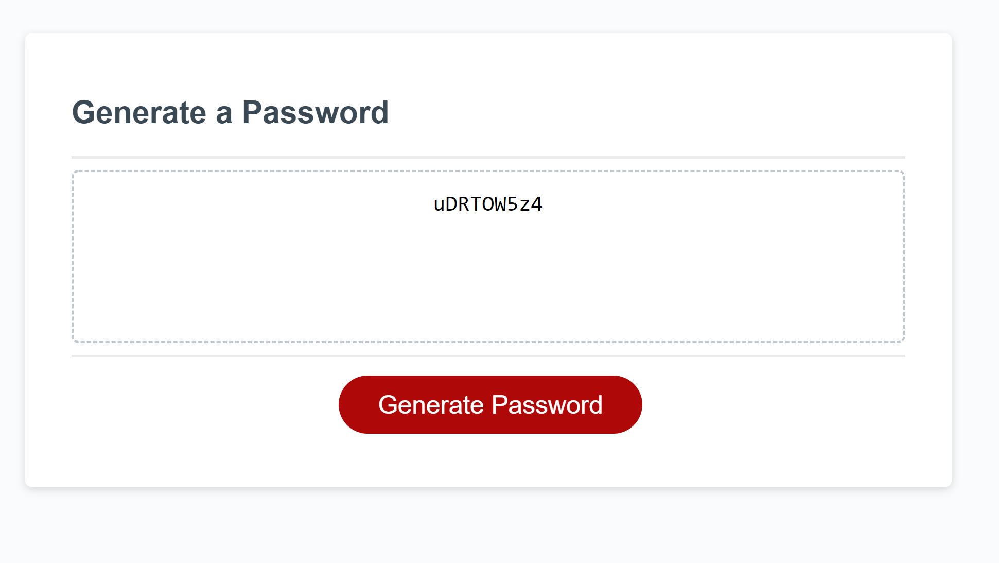
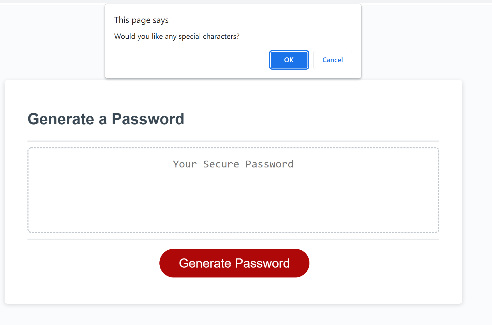

# password-Generator: Task

# Site Link
https://hoeferm2.github.io/password-debug-challenge/

# git-hub Repository Link
https://github.com/hoeferm2/password-debug-challenge
## This weeks task

The task for this weeks challenge was to make a password generator that run the user through a series of prompts to custom design a random password.

## Generate Password button

Users start the process by clicking on the generate password button which runs through a series of prompt and confirm pop ups. Initially the user must choose a number between 8 -128. Numbers outside of this parameter are rejected the the user is sent back to the generate password button

## Confirm Prompts

Once users have selected an accepted password length they are given several confirm prompts to choose how to format thier password. There are 4 different global string variables that each confirm prompt corresponds to. By denying specific confirm alerts is overwriting the specific variable string with an empty string.

## Password Randomizer

At the end of the string of confirm prompts a new variable is created

var finalChoice 

This variable will then go through a password randomizer and create a randomly generated password based on the users specifications.

